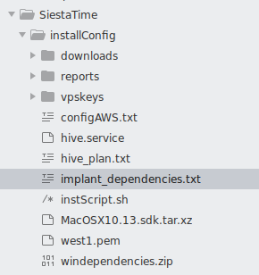
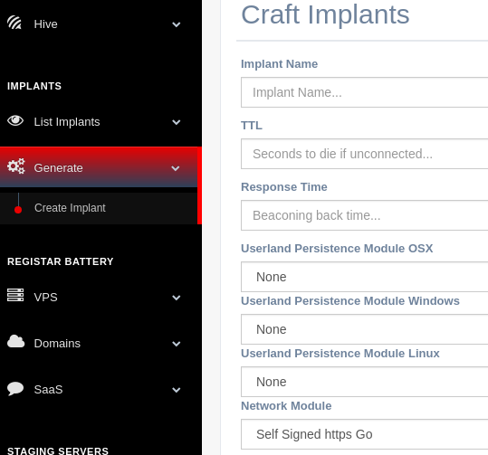

Siesta Time: User Guide
=======================================

.. meta::
   :description lang=en: Red Team, offensive security, automatic deployment,implants,reporting.

`Siesta Time`_ is a red team framework with the purpose of automating and facilitating implants creation and their C2 Infrastructure.All these actions keeping trace of what your Operators are doing. 

Save your Different Network Infrastructure Elements
    Save units of virtual private cloud,domains and software as a service 
    credentials to be able to deploy C2 infrastructure.

Deploy Implants that adapt to your current target
    Select Implant configuration,modules and set of redirectors.
    The different modules available will define how the implant will egress, persist in target foothold...
    The output will be binaries for different devices and the working C2.

Maintain Access and Interact with your foothold
    Once the delivery process is successful and the implant is executed, list your infected devices.
    Interact with them to send essentials commands or put them to sleep.

Deploy Post. Exploitation Servers for Lateral Movement
    With the objective to achieve further target's assets from their intranet, Siesta Time can use
    your resource battery to deploy "shorted lived" handlers (ssh,msf,empire...) 

Document the whole Operation to provide insights to the target institution's Blue Team or Stakeholders
    Reporting will focus on saving every framework job and action execute in footholds or Post.
    Exploitation handlers.

.. _Siesta Time: https://github.com/rebujacker/SiestaTime

Installation
----------------

SiestaTime installation needs just two elements to work properly, the Hive, normally installed by the operations admin/manager, and the client, for the Operators.

.. note::
    Installation for both Hive and client is designed for the moment just 
    for Ubuntu (tested on Ubuntu 18.04.4 LTS)

Everything related to the installation process for both Hive and client will be saved on:

.. prompt:: bash $

    ./SiestaTime/installConfig

* **Dependencies**:
  :doc:`Windows <install/dependencies>` |
  :doc:`Darwin <install/dependencies>`

* **Hive**:
  :doc:`Online <install/hive>` |
  :doc:`Offline <install/hive>`

* **Client**:
  :doc:`Install<install/client>`

.. toctree::
   :maxdepth: 2
   :hidden:
   :caption: Installation

   install/dependencies
   install/hive
   install/client

Adding Resources
-----------------------------------

Saving online infrastructure resources will be the first steps to use Siesta Time. If you don’t desire to use automatic deployment of implants you can always deploy an Offline version of them where just executables will be generated.

* **Virtual Private Clouds**:
  :doc:`AWS <resources/vpc>`

* **Domains**:
  :doc:`GoDaddy <resources/domains>` |
  :doc:`Gmail <resources/domains>`

* **Operators**:
  :doc:`Operators <resources/operators>`

.. toctree::
   :maxdepth: 2
   :hidden:
   :caption: Adding Resources

   resources/operators
   resources/vpc
   resources/domains
   

Hive Status
----------------------------------

The Hive Status provide red teamers a bunch of tabs where they can check every job processed by Hive.
If any problem appears during the process of these, the Logs will show errors details.

* **Hive Jobs**:
  :doc:`Jobs <hive/jobslogs>`

* **Hive Logs**:
  :doc:`Logs <hive/jobslogs>`

.. toctree::
   :maxdepth: 2
   :hidden:
   :caption: Hive Status

   hive/jobslogs

Deployment
--------------------------------------------------------------

Once the red team has registered every resource that they want to use for their C2 infrastructure these can be use to generate it.
Implants (redirectors and executables) and Post. Exploitation servers (droplets,handlers...)

* **Implants**:
  :doc:`Basic Config. <deployment/implants>` |
  :doc:`Network Modules <deployment/implants>` |
  :doc:`Persistence Modules <deployment/implants>` |
  :doc:`Redirectors <deployment/implants>`

* **Post. Servers**:
  :doc:`Droplets <deployment/postservers>` |
  :doc:`Handlers <deployment/postservers>`

.. toctree::
   :maxdepth: 2
   :hidden:
   :caption: Deployment

   deployment/implants
   deployment/postservers

Interactions
------------------------------------------

After the deployment the red team should design a kill-chain/attack that requires normally the delivery of the previous generated executable.
Once the delivery is successful, Hive will start to receive connections from the foothold. 
Lateral movement may be required to acquire further target assets.
Bichito has the capability to retrieve basic commands that will be used to persists or escalate privileges.
If the operator needs a more complex connection to the foothold (ssh,remote desktop, tunnelization...) Post. Exploitation servers will be used. through new processes triggered from Bichito.

.. figure:: ./_static/images/interactions/sshinteract.png
    :align: right
    :figwidth: 300px
    :target: ./_static/images/interactions/sshinteract.png

* **Implants**:
  :doc:`Implant Info <interactions/implants>` |
  :doc:`Download <interactions/implants>`

* **Bichitos**:
  :doc:`Status <interactions/bichitos>` |
  :doc:`Console <interactions/bichitos>`

* **Post. Exploitation**:
  :doc:`SSH <interactions/postinteractions>` |
  :doc:`MSF <interactions/postinteractions>` |
  :doc:`Empire <interactions/postinteractions>`

.. toctree::
   :maxdepth: 2
   :hidden:
   :caption: Interactions

   interactions/implants
   interactions/bichitos
   interactions/postinteractions

Reporting
------------------------------------------

Reports are a way to extract every action performed by Operators using the SiestaTIme framework.

.. toctree::
   :maxdepth: 2
   :hidden:
   :caption: Reporting

   reporting/basicreport

Concepts,Bugs and Dependencies
------------------------------------------

SiestaTime is still in its Beta version, a lot of work and testing is still needed, these are common issues that you may encounter.
Software compatibility List.

* **Theory**:
  :doc:`Concepts <misc/concepts>`

* **Known Bugs**:
  :doc:`Bugs <misc/bugs>`

.. toctree::
   :maxdepth: 2
   :hidden:
   :caption: Concepts,Bugs and Dependencies

   misc/concepts
   misc/bugs