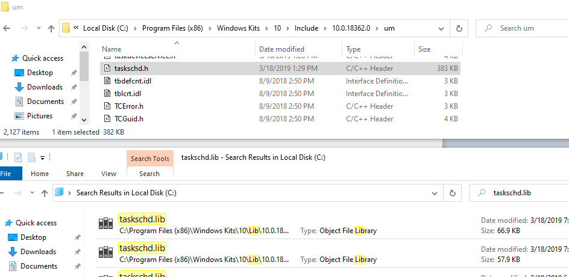

Dependencies
===========================

Some of the modules and capabilities of Bichito are written using native libraries of target OS Devices. For the proper functioning of them, target OS dependencies need to be acquired.

Why Dependencies?
-------------------

SiestaTime is designed to generate implants for three platforms: **Linux,Windows and Darwin**
It will use Go to compile the implants  for target OS and architecture, but some of the implants functionalities require more specific dependencies.
To do the "system level delicate stuff" SiestaTime will use ``cgo`` and ``C wrappers`` to call C++, Objective-C, which will require certain target OS dependencies (that will be statically linked in the compilation process of the implants).

* Windows: ``CGO + MinGW`` 

* Darwin: ``CGO + OSXCross`` 

Get Dependencies from Windows 10
--------------------------------------------

To properly install Hive a set of dependencies extracted from Windows need to be in place first. This will be necessary to be able to compile some implant modules for windows. The result of this step should be a zipped folder with the following  structure:

::

    includes/
        taskschd.h
    libs/
        x86/
            comsupp.lib
        x64/
            comsupp.lib

This zip needs to be placed:

.. prompt:: bash $

    ./SiestaTime/installConfig/windependencies.zip

The command you can run for generating the resulting zip:

.. prompt:: bash $

    zip -r windependencies.zip *

**Search for target dependencies**

* Perform a clean Windows 10 Installation (EG. virtual machine)

* Install microsoft visual studio community() with ``C++ Console apps Development``

* Copy target files keeping previous folder structure. You can just find the files on windows after Visual Studio with C++ support is installed (listed at ``./SiestaTime/installConfig/implant_dependencies.txt`` )

.. note::
    A script will be provided in the future when dependency tree grow bigger

Get Dependencies from Darwin (Mac OSX)
--------------------------------------------------

A. Install  XCode on MacOSX 10.13
B. ``git clone https://github.com/tpoechtrager/osxcross``
C. Run osxcross extract script

.. prompt:: bash $

   ./tools/gen_sdk_package.sh

D. Copy output file to ``SiestaTime/installConfig/MacOSX10.13.sdk.tar.xz``

.. note:: Since i386 has been dropped <= most ideally 10.13 of your Darwin OS should be used