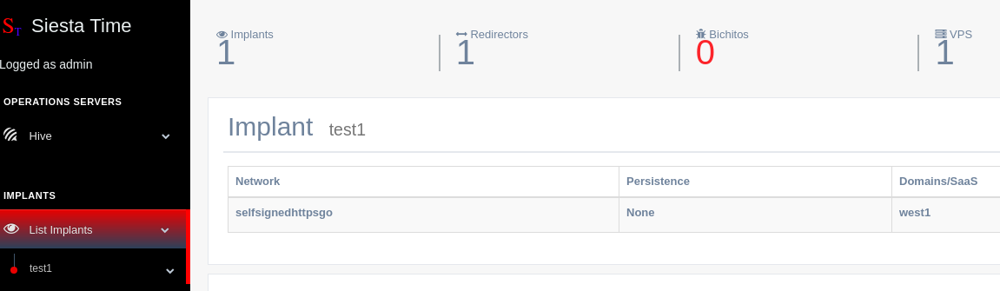
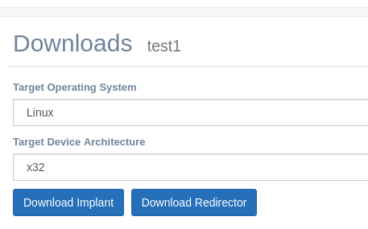
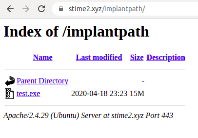

Implants
===========================

Once the Implants and Post. Servers are created and you already have the infrastructure ready to go on a Red team operation.
Now you are ready to download them for delivery purposes.

Information
--------------------------------------------

``Implants --> ImplantName``

Download Implant
--------------------------------------------------

Once the implant is listed, it is possible to download from hive both implant and redirector executables

``Implants --> ImplantName --> Download``

.. note::
	Every Download on Hive will be made to ``SiestaTime/installConfig/downloads``

Delivery - Attacks
--------------------------------------------------

Once the implant is created some Delivery options or “Attacks” will be available. In the future, delivery options like phishing, macro… will be available.

Drop Implant
~~~~~~~~~~~~~~~~~~~~~~~~~~~~~~

To drop implant simply choose a previously created droplet

HTA
~~~~~~~~~~~~~~~~~~~~~~~~~~~~~~
``TBD``