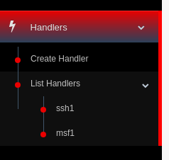
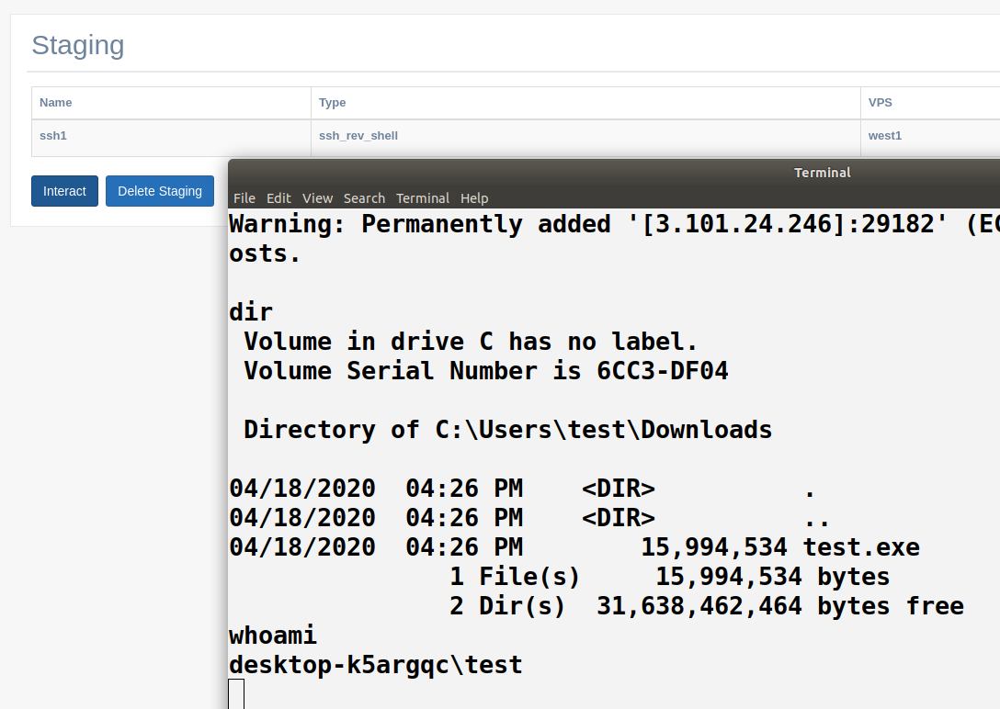
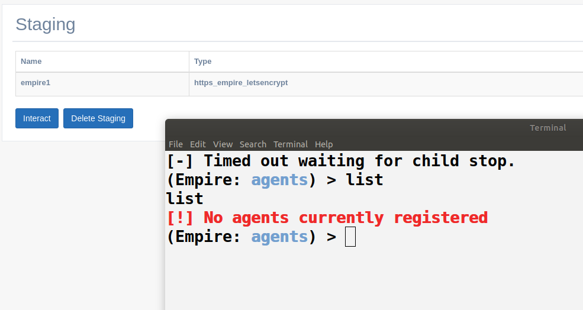

Post. Servers
=====================================================

Most of the previously created Handlers can be interacted with. This menu will be found on “Handlers” tab

Interact with SSH
--------------------------------------------

Interact with a SSH Rev Handler will be possible once a bichito has been attached to it. 

.. note::
    SSH Sessions have a TTL of 10 min of inactivity. It is just possible to interact with 1 Bichito per Rev SSH handler in the same time

.. warning::
    For the moment these ssh are not fully interactive ``TBD``

Empire and Metasploit
--------------------------------------------------

Interacting with both MSFT and Empire is very straightforward. Once created just click “Interact” and you will be provided by a console directly bonded to the target's MSFT/Empire Server.

