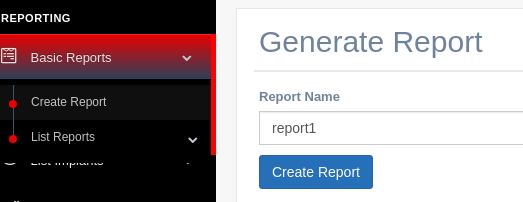

Basic Reports
===========================

For the moment is just a plain text document, but in the future a more elaborated report will be developed.

* The reports will have the following strings:
	* Report Name
	* Report Creation Time
	* Every Job Processed by Hive
	* Every Job sent to bichitos
	* Every command processed through post-exploitation servers (Interactive Sessions per user and time, with their outputs)

Create Report
--------------------------------------------

``Basic Reports --> Create Report``

List Reports,Download
--------------------------------------------------

Once the report is created it can be downloaded from hive. They will be automatically placed in: ``SiestaTime/installConfig/reports``