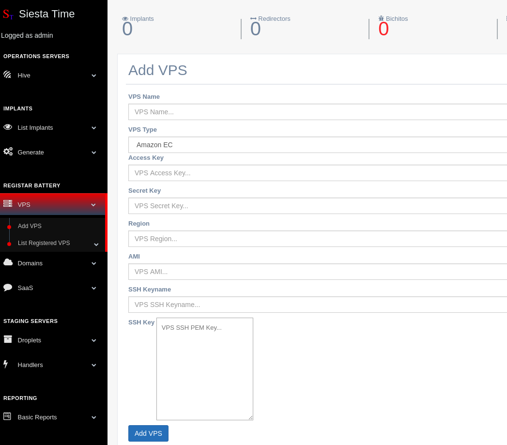

Virtual Private Cloud
===========================

This tab will be used to handle VPC instances that you can save for their late use in deployment of resources.

``VPS --> Add VPS``

AWS
-----------

* Inputs
    * VPS Name: Resource Name
    * VPS Type: ec2 instance type
    * Access Key: 
    * Secret Key:
    * Region: `region`_ 
    * AMI: `ami`_ 
    * SSH Keyname: EC2 keyname
    * SSH Key: EC2 pem key string

Azure
---------------

TBD

.. _ami: https://docs.aws.amazon.com/AWSEC2/latest/UserGuide/finding-an-ami.html
.. _region: https://docs.aws.amazon.com/AmazonRDS/latest/UserGuide/Concepts.RegionsAndAvailabilityZones.html

